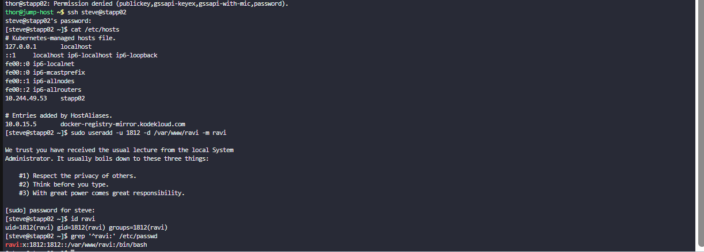

# 🐧 Linux Administration Challenge #001: Provisioning a Dedicated Apache Application User

> **Category:** User Management
> **Difficulty:** Beginner
> **Focus Area:** Linux Administration & Security Hardening

---


## 📖 Scenario

As part of a security hardening initiative, **xFusionCorp Industries** has adopted a policy of using dedicated Linux users for individual web applications instead of shared service accounts.

This approach improves application isolation, simplifies permission management, and reduces the potential impact of security incidents.

My task was to create a dedicated Apache application user on **App Server 2** with a custom UID and home directory.

---

## 🎯 Challenge Requirements

| Parameter      | Value           |
| -------------- | --------------- |
| Username       | `ravi`          |
| UID            | `1812`          |
| Home Directory | `/var/www/ravi` |
| Target Server  | App Server 2    |

---

## 🛠️ Solution

### Create the User

```bash
sudo useradd -u 1812 -d /var/www/ravi -m ravi
```

### 🔍 Command Breakdown

| Option             | Description                                             |
| ------------------ | ------------------------------------------------------- |
| `useradd`          | Creates a new local user account                        |
| `-u 1812`          | Assigns a custom User ID (UID)                          |
| `-d /var/www/ravi` | Sets the user's home directory                          |
| `-m`               | Creates the home directory if it does not already exist |
| `ravi`             | Username being created                                  |

---

## ✅ Verification

### Verify User Information

```bash
id ravi
```

Expected Output:

```text
uid=1812(ravi) gid=1812(ravi) groups=1812(ravi)
```

---

### Verify Home Directory

```bash
ls -ld /var/www/ravi
```

---

### Verify User Entry

```bash
grep '^ravi:' /etc/passwd
```

Expected Output:

```text
ravi:x:1812:1812::/var/www/ravi:/bin/bash
```

---

## 📸 Challenge Execution Proof

The screenshot below demonstrates:

* ✅ Successful login to App Server 2
* ✅ Creation of user `ravi`
* ✅ Assignment of custom UID `1812`
* ✅ Verification using the `id` command
* ✅ Verification through `/etc/passwd`


---

## 🔐 Security Insights

Using dedicated application users is considered a security best practice in enterprise environments.

### Benefits

🛡️ **Application Isolation**

Each application operates under its own identity, reducing cross-application access.

🔒 **Principle of Least Privilege**

Permissions can be assigned only where required.

📊 **Improved Auditing**

User-specific actions are easier to track and investigate.

🚨 **Reduced Blast Radius**

If one application account is compromised, other services remain isolated.

---

## 🌍 Real-World Relevance

This task mirrors activities commonly performed by:

* Linux System Administrators
* DevOps Engineers
* Site Reliability Engineers (SREs)
* Cloud Infrastructure Engineers

Dedicated service accounts are widely used for:

* Apache HTTP Server
* NGINX
* CI/CD Runners
* Monitoring Agents
* Application Services
* Containerized Workloads

---

## 📚 Skills Demonstrated

* Linux User Management
* Custom UID Assignment
* Home Directory Configuration
* System Verification & Validation
* Security Hardening Fundamentals
* Linux Command-Line Operations

---

## 💡 Key Takeaway

While creating a user account may seem like a basic administrative task, it represents a foundational security practice used throughout enterprise Linux environments. Proper user provisioning improves application isolation, strengthens access control, and contributes to a more secure and maintainable infrastructure.

---


## 🎓 Lessons Learned

Through this challenge, I strengthened my understanding of:

- Linux user provisioning
- Custom UID assignment
- Home directory management
- Account verification techniques
- Security best practices for application isolation

Even simple administrative tasks can play a critical role in securing enterprise Linux environments.

## 🚀 Interview Talking Point

> Provisioned a dedicated Linux service account with a custom UID and application-specific home directory. Applied security best practices by implementing account isolation and validating the configuration using standard Linux administration tools such as `id`, `grep`, and `/etc/passwd`.
